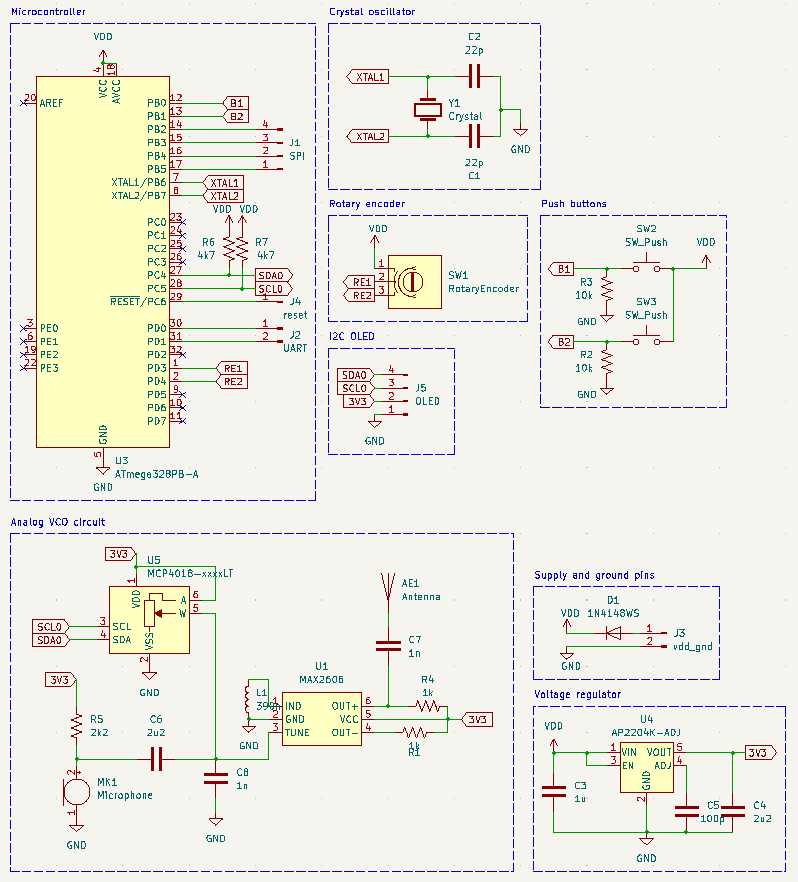
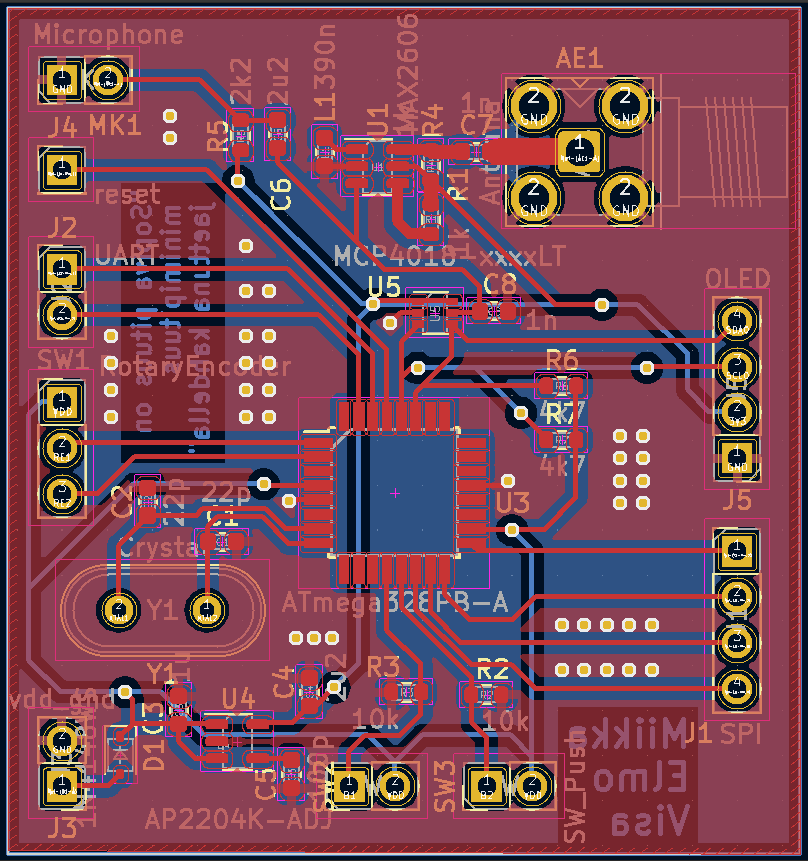
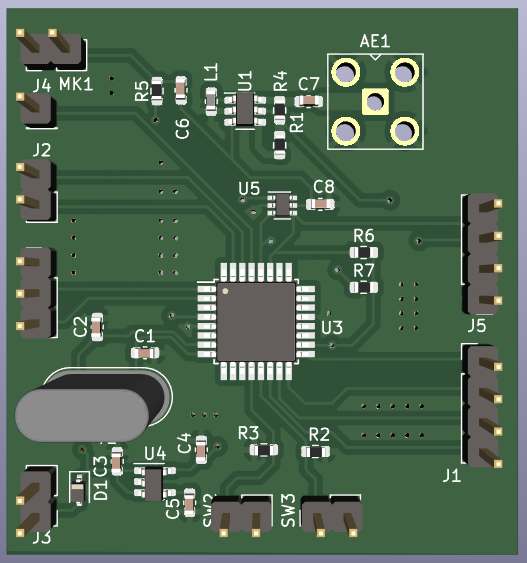

# RF transmitter

## Contributors

### [Elmo Kankkunen](https://github.com/kankkueo)

### [Miikka Mäki](https://github.com/mimimaki)

### [Visa Kurvi](https://github.com/visakurvi)

## Description

The project is very low power and thus legal, but be aware of your local laws and regulations!

RF transmitter project for Aalto university course Elektroniikkapaja. The transmitter consists of a digital and analog circuits. The digital circuit has an ATMEGA328 microcontroller, which controls a digital potentiometer. This potentiometer sets the voltage level of an MAX2606 VCO input. This is how the transmitter frequency is controlled. Audio from a microphone is then modulated to this FM-signal. 

## Screenshots

## SDR++ captured demo

[

## License

MIT License
